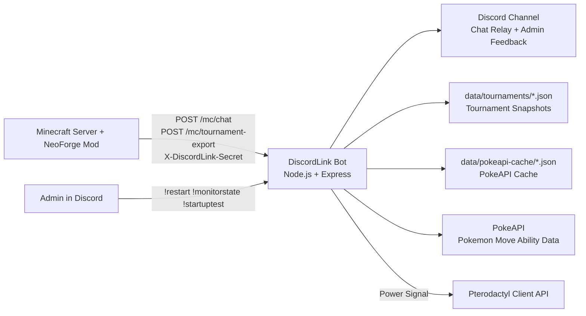

# DiscordLink Bot

Production-oriented Discord bot and HTTP bridge service used by the DiscordLink Minecraft integration.

This service does two jobs:

1. Operates as a Discord bot for chat relay and server administration workflows.
2. Exposes authenticated HTTP endpoints that the NeoForge mod calls from Minecraft.

## Highlights

- Real-time Minecraft to Discord chat relay.
- Secure shared-secret authentication for mod-to-bot requests.
- Tournament snapshot ingest and web viewer generation.
- Optional hidden weakness-analysis mode gated by a secret token.
- Admin-only server restart workflow through the Pterodactyl Client API.
- Local and disk-backed PokeAPI caching for lower latency and reduced API calls.

## Architecture

- Runtime: Node.js + Express + discord.js.
- Ingress: HTTP endpoints under `/mc/*` and `/api/*`.
- Egress: Discord channel messages and role mentions.
- Persistence:
	- `data/tournaments/*.json` for tournament snapshots.
	- `data/pokeapi-cache/*.json` for cached PokeAPI responses.

## Requirements

- Node.js 18 or newer (Node 20 recommended).
- Discord bot token and target channel ID.
- Shared secret configured on both bot and mod.

## Environment Variables

| Variable | Required | Description |
| --- | --- | --- |
| `DISCORD_BOT_TOKEN` | Yes | Discord bot token. |
| `BOT_HTTP_PORT` | No | HTTP server port. Default: `3000`. |
| `MINECRAFT_DISCORD_CHANNEL_ID` | Yes | Discord channel that receives Minecraft relay messages. |
| `MINECRAFT_DISCORD_ROLE_ID` | No | Role ID to mention on startup relay messages. |
| `DISCORDLINK_SHARED_SECRET` | Yes | Shared secret for authenticating bridge requests. |
| `TOURNAMENT_WEAKNESS_SECRET` | No | Secret token that enables weakness data in tournament views. |
| `MINECRAFT_DISCORD_ADMINROLE_ID` | For admin commands | Role allowed to run restart and monitor commands. |
| `PTERODACTYL_PANEL_URL` | For admin commands | Base URL of your Pterodactyl panel. |
| `PTERODACTYL_SERVER_ID` | For admin commands | Target Minecraft server ID on Pterodactyl. |
| `PTERODACTYL_CLIENT_API_KEY` | For admin commands | Pterodactyl client API key. |
| `RESTART_COOLDOWN_MS` | No | Cooldown between `!restart` calls. Default: `60000`. |
| `PTERODACTYL_STARTUP_PING_ENABLED` | No | Enables monitor-based startup pings. Default: enabled unless set to `false`. |
| `PTERODACTYL_STATE_POLL_MS` | No | Poll interval for state monitor. Minimum `5000`, default `15000`. |

## API Reference

All bridge endpoints require this header:

- `X-DiscordLink-Secret: <DISCORDLINK_SHARED_SECRET>`

### Health

- `GET /health`
- Returns bot readiness status.

### Minecraft Chat Relay

- `POST /mc/chat`
- Request body:

```json
{
	"player": "SERVER",
	"message": "@minecraft Server has started."
}
```

- Behavior: relays content into the configured Discord channel.

### Tournament Export

- `POST /mc/tournament-export`
- Request body: tournament snapshot payload from the mod.
- Response includes:
	- `slug`
	- `publicUrl`
	- `weaknessHint` when weakness secret is configured

### Tournament Web and API Views

- `GET /tournament/:slug`
	- Public tournament view.
- `GET /tournament/:slug/weak/:weaknessToken`
	- Redirect helper that injects weakness token.
- `GET /api/tournament/:slug`
	- Tournament JSON payload.
	- Weakness data appears only when valid token is supplied in query (`?w=<token>` or `?weak=<token>`).

## Discord Commands

- `!ping`
	- Liveness check.
- `!restart`
	- Admin-only. Sends restart signal to Pterodactyl with cooldown enforcement.
- `!startuptest`
	- Admin-only. Sends startup relay test message.
- `!monitorstate`
	- Admin-only. Shows last-known and current monitored server states.

## Quick Start

1. Install dependencies:

```bash
npm install
```

2. Create `.env` with required variables.

3. Start the bot:

```bash
npm start
```

4. Verify service health:

```bash
curl http://localhost:3000/health
```

## Security Notes

- The bot refuses bridge requests when `DISCORDLINK_SHARED_SECRET` is missing.
- Secret comparison uses timing-safe checks.
- Keep `.env` and API keys out of source control.

## Resume-Ready Impact Bullets

- Built and deployed a production-style Node.js service that bridges Minecraft server events to Discord in real time.
- Designed authenticated HTTP integration between a game mod and backend service using shared-secret validation and timing-safe comparison.
- Implemented tournament export ingestion and a dynamic web viewer, enabling players and admins to review structured team data quickly.
- Integrated Pterodactyl API controls for role-gated server restart operations with cooldown and operational safeguards.
- Reduced external API overhead with in-memory plus disk-backed caching for PokeAPI-driven enrichment.

## Architecture Diagram



## Project Layout

- `index.js`: bot runtime, HTTP API, tournament render and enrichment pipeline.
- `data/tournaments/`: stored tournament snapshots.
- `data/pokeapi-cache/`: persistent PokeAPI cache.

